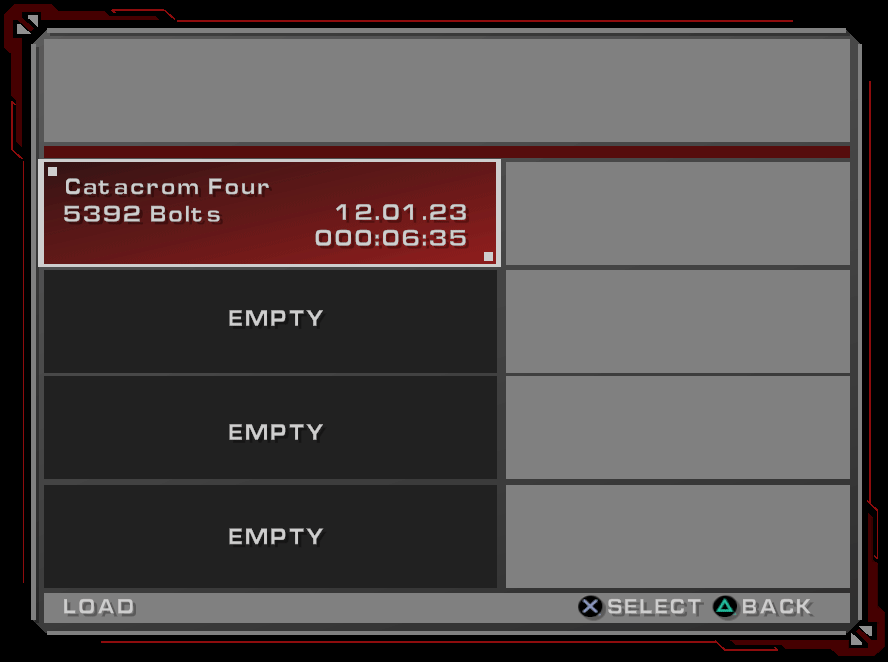

# Deadlocked Rerendered
Unity render wrapper for Ratchet: Deadlocked running in PCSX2.

Windows only atm.

# Screenshots
Main Menu


# Building
1. Install the dependencies
    * Unity 2022.3.9f1
      * Windows Build Support (IL2CPP) module
    * docker
    * Visual Studio 2022
2. Clone the repo
> git clone --recursive https://github.com/dnawrkshp/deadlocked-rerendered
3. Configure
    * Copy `rerenderer/base_config.json` into `rerenderer/config.json`
    * Open `rerenderer/config.json`
    * Update `IsoPath` to the full path to your Deadlocked iso
    * Update `BiosFolder` to the directory of your bios
    * Update `BiosFilename` to the filename of your bios

Example:
```json
{
  "IsoPath": "M:\\Games\\Ratchet Deadlocked.iso",
  "Emulator": {
    "BiosFolder": "M:\\pcsx2\\emu\\bios",
    "BiosFilename": "SCPH-77001_BIOS_VX_USA_220.BIN"
  }
}
```

3. Open the `renderer/` project folder in Unity
4. Open the scene `Scenes/Main.unity`
5. Hit play

# PCSX2
The interop and syncing between the Unity client and PCSX2 requires a special build of PCSX2 with some modifications that can be found here https://github.com/Dnawrkshp/pcsx2/tree/embedded-latest.
